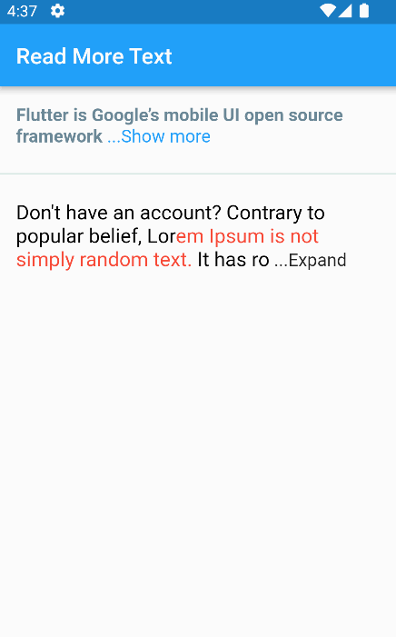

[](https://codecov.io/gh/thierryoliveira/rich_readmore)


# rich_readmore

A widget that displays text with an option to show more or show less based on the provided settings.  
The `RichReadMoreText` widget allows you to trim text either based on the character length or the number of lines.  
When the text is longer than the specified trim length or exceeds the maximum number of lines, it provides a toggle option to show more or show less of the text.  
It has two options for settings, the `LineModeSettings` or `LengthModeSettings` for trimming using the behavior that you want.  
If you want to pass a string directly instead of a TextSpan, you can just be using the the `RichReadMoreText.fromString(...)`. There are some examples for that below.

## Demonstration  

## How to use
import:
```
import 'package:rich_readmore/rich_readmore.dart';
```
For TextSpan data:
 ```dart
  RichReadMoreText(
    textSpan,
    settings: LineModeSettings(
      trimLines: 3,
      trimCollapsedText: 'Expand',
      trimExpandedText: ' Collapse ',
      onPressReadMore: () {
        /// specific method to be called on press to show more
      },
      onPressReadLess: () {
        /// specific method to be called on press to show less
      },
    ),
  ),
 ```

Or for String data:
```dart
 RichReadMoreText.fromString(
   text: 'Lorem ipsum dolor sit amet, consectetur adipiscing elit.',
   textStyle: TextStyle(color: Colors.purpleAccent),
   settings: LengthModeSettings(
     trimLength: 20,
     trimCollapsedText: 'Expand',
     trimExpandedText: ' Collapse ',
     onPressReadMore: () {
       /// specific method to be called on press to show more
     },
     onPressReadLess: () {
       /// specific method to be called on press to show less
     },
     lessStyle: TextStyle(color: Colors.blue),
     moreStyle: TextStyle(color: Colors.blue),
   ),
 ),
```


